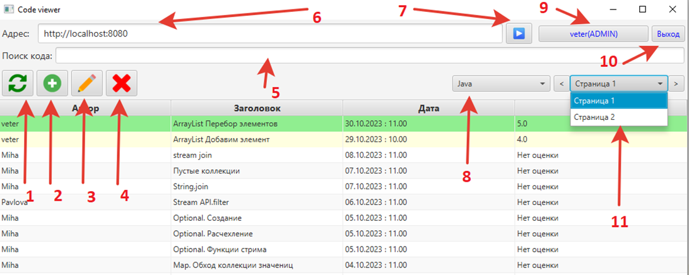

# Это тестовый readme

---

<b>Структура проекта</b>

---

<b>Описание функционала программы</b>

## Тут описание

#### Стек-технологий, используемый в приложении:
- [Java 11](https://docs.aws.amazon.com/corretto/latest/corretto-11-ug/downloads-list.html)